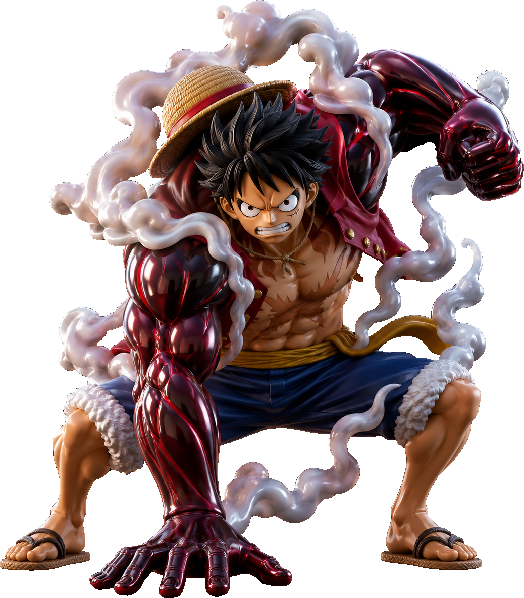

# Luffy Evolution Showcase

A premium, interactive carousel showcasing Monkey D. Luffy's Gear Evolution from the anime *One Piece*. Designed with a cinematic, poster-like aesthetic, this project features fluid animations, dynamic typography, and a polished production-ready UI.

## 🌟 Features

- **Interactive Carousel**: Seamlessly transition between Gear 2, Gear 4, and Gear 5.
- **Dynamic Theming**: Backgrounds, typography colors, and UI elements automatically adapt to match the active Gear's aesthetic.
- **Cinematic Transitions**: Smooth 650ms `cubic-bezier` animations for background colors, image scaling, blurring, and text fading.
- **Responsive Design**: Fully optimized for both desktop and mobile viewing experiences.
- **Premium Typography**: Utilizes bold system display fonts (`Impact`, `Haettenschweiler`, `Arial Black`) combined with clean sans-serifs (`Inter`, `SF Pro Display`) for a modern, high-contrast look without relying on external web fonts.
- **Offline Ready**: No external font dependencies or CDNs are required.

## 📸 Screenshots

*(Replace these with actual screenshots of your running application)*

| Gear 2 | Gear 4 | Gear 5 |
|:---:|:---:|:---:|
|  |  |  |

> *Note: The images above are the raw character assets used in the application.*

## 🚀 Tech Stack

- **Framework**: [React 19](https://react.dev/)
- **Build Tool**: [Vite 6](https://vitejs.dev/)
- **Styling**: [Tailwind CSS 4](https://tailwindcss.com/)
- **Language**: [TypeScript](https://www.typescriptlang.org/)
- **Icons**: [Lucide React](https://lucide.dev/)

## 📦 Installation & Setup

1. **Install dependencies**:
   ```bash
   npm install
   ```
2. **Start the development server**:
   ```bash
   npm run dev
   ```
3. **Build for production**:
   ```bash
   npm run build
   ```

## 🎨 Design System

- **Layout Structure**: Asymmetric, negative-space-heavy composition designed to feel like a collectible statue landing page.
- **Ghost Typography**: Giant background text acts as a watermark, adapting its opacity and color based on the active theme.
- **Information Panel**: Fixed UI overlay containing descriptions and navigation, ensuring maximum readability independent of the hero image.
- **Color Palette**: 
  - **Gear 2**: Deep fiery red (`#D94A38`)
  - **Gear 4**: Dark haki crimson (`#4B0F1F`)
  - **Gear 5**: Bright heavenly white (`#EFEFEF`)

## 📄 Legal

This project is created for demonstration and portfolio purposes. All character assets and names (Monkey D. Luffy, One Piece, Gear 2/4/5) are the property of Eiichiro Oda, Shueisha, and Toei Animation.

---
Created with ❤ by Karar Haider
